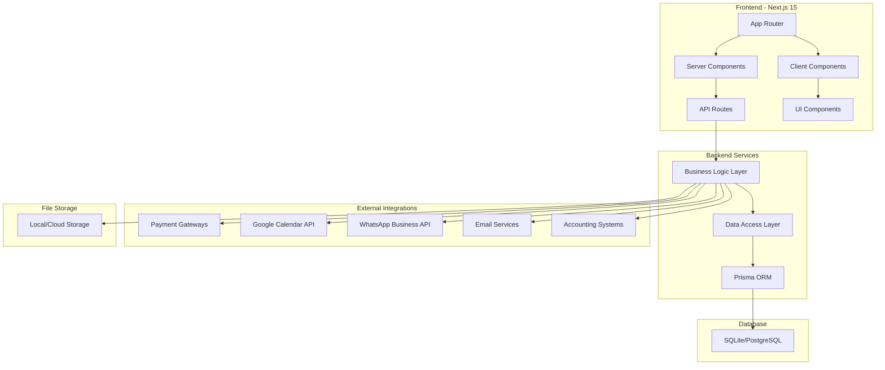
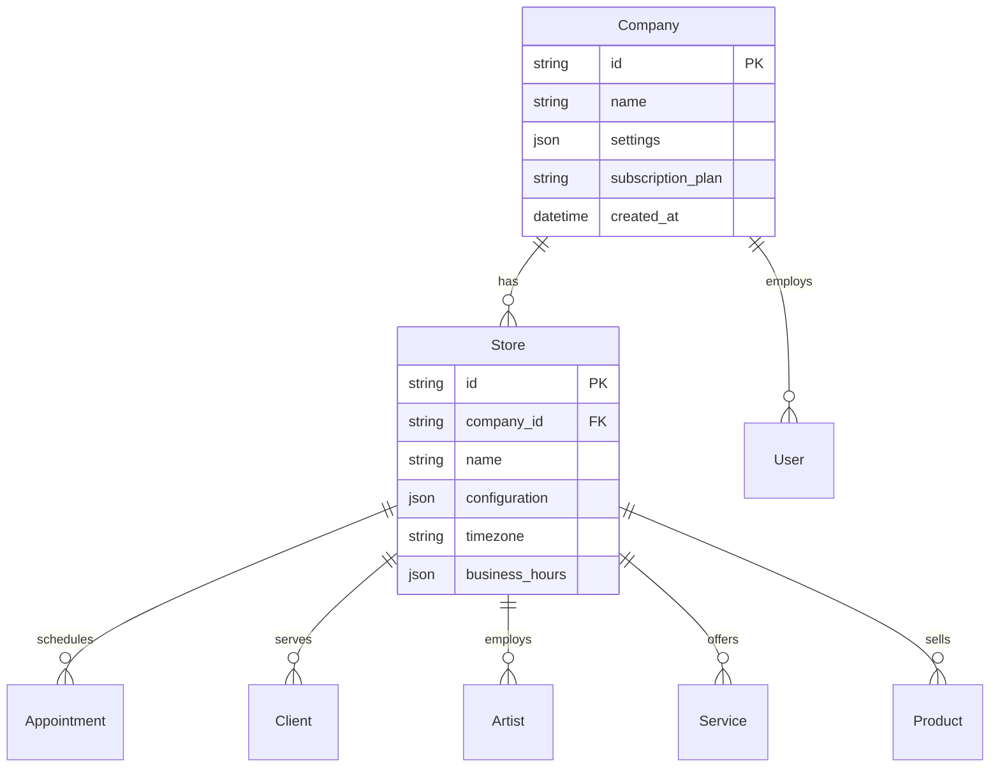

# Documento de Diseño - InkGest

## Visión General

InkGest es una aplicación web progresiva (PWA) construida como monorepo con Next.js 15, diseñada para gestionar centros de tatuaje y arte corporal. La arquitectura sigue un patrón multi-tenant que permite la gestión independiente de múltiples empresas y tiendas, con soporte completo para internacionalización y cumplimiento normativo español.

## Arquitectura

### Arquitectura General del Sistema



### Arquitectura Multi-Tenant

La aplicación implementa un modelo de multi-tenancy a nivel de base de datos con aislamiento por `company_id` y `store_id`:



### Stack Tecnológico

- **Frontend**: Next.js 15 con App Router, React 18, TypeScript (strict mode)
- **Styling**: Tailwind CSS con CSS Modules para componentes específicos
- **Base de Datos**: SQLite (desarrollo) → PostgreSQL (producción)
- **ORM**: Prisma con migraciones automáticas y tipos generados
- **Autenticación**: NextAuth.js con múltiples proveedores
- **Internacionalización**: next-intl para español, català e inglés
- **Estado Global**: Zustand con tipos estrictos
- **Validación**: Zod para validación de esquemas y tipos runtime
- **Testing**: Jest + React Testing Library + Playwright
- **Linting**: ESLint con reglas estrictas de TypeScript
- **Formateo**: Prettier con configuración consistente

## Componentes y Interfaces

### Estructura de Directorios del Monorepo

```
inkgest/
├── apps/
│   ├── web/                    # Aplicación principal Next.js
│   │   ├── app/               # App Router de Next.js 15
│   │   │   ├── [locale]/      # Rutas internacionalizadas
│   │   │   │   ├── (dashboard)/  # Grupo de rutas del dashboard
│   │   │   │   ├── (auth)/       # Grupo de rutas de autenticación
│   │   │   │   └── layout.tsx    # Layout por idioma
│   │   │   ├── api/           # API Routes
│   │   │   └── globals.css    # Estilos globales
│   │   ├── components/        # Componentes React reutilizables
│   │   │   ├── ui/           # Componentes base (Button, Input, etc.)
│   │   │   ├── forms/        # Componentes de formularios
│   │   │   ├── layout/       # Componentes de layout
│   │   │   └── features/     # Componentes específicos por feature
│   │   ├── hooks/            # Custom hooks reutilizables
│   │   ├── services/         # Lógica de negocio y APIs
│   │   ├── utils/            # Funciones utilitarias y helpers
│   │   ├── styles/           # Estilos globales y variables
│   │   ├── types/            # Tipos TypeScript específicos de la app
│   │   └── public/           # Assets estáticos
│   └── mobile/               # Futura app móvil (React Native)
├── packages/
│   ├── database/             # Esquemas Prisma y migraciones
│   ├── ui/                   # Componentes UI compartidos
│   ├── utils/                # Utilidades compartidas
│   ├── types/                # Tipos TypeScript compartidos
│   ├── config/               # Configuraciones compartidas
│   └── eslint-config/        # Configuración ESLint compartida
├── docs/                     # Documentación
└── tools/                    # Scripts y herramientas
```

### Componentes Principales de la UI

#### 1. Layout y Navegación

```typescript
// components/layout/AppLayout.tsx
interface AppLayoutProps {
  children: React.ReactNode;
  company: Company;
  store: Store;
  user: User;
  locale: 'es' | 'ca' | 'en';
}

const AppLayout: React.FC<AppLayoutProps> = ({ 
  children, 
  company, 
  store, 
  user, 
  locale 
}) => {
  return (
    <div className="min-h-screen bg-background">
      <Sidebar user={user} permissions={user.permissions} />
      <Header 
        company={company} 
        store={store} 
        user={user} 
        locale={locale}
      />
      <main className="ml-64 pt-16">
        <Breadcrumbs />
        {children}
      </main>
      <NotificationCenter userId={user.id} />
    </div>
  );
};

// Componentes principales con tipos estrictos:
interface SidebarProps {
  user: User;
  permissions: Permission[];
}

interface HeaderProps {
  company: Company;
  store: Store;
  user: User;
  locale: 'es' | 'ca' | 'en';
}

interface NotificationCenterProps {
  userId: string;
}
```

#### 2. Gestión de Citas

```typescript
// components/appointments/CalendarView.tsx
type CalendarView = 'day' | 'week' | 'month';
type AppointmentStatus = 'scheduled' | 'confirmed' | 'in_progress' | 'completed' | 'cancelled';

interface CalendarViewProps {
  view: CalendarView;
  artists: Artist[];
  rooms: Room[];
  appointments: Appointment[];
  onAppointmentCreate: (appointment: CreateAppointmentData) => Promise<void>;
  onAppointmentUpdate: (id: string, data: UpdateAppointmentData) => Promise<void>;
  onViewChange: (view: CalendarView) => void;
}

interface CreateAppointmentData {
  clientId: string;
  artistId: string;
  serviceId: string;
  roomId?: string;
  startTime: Date;
  endTime: Date;
  notes?: string;
}

interface UpdateAppointmentData extends Partial<CreateAppointmentData> {
  status?: AppointmentStatus;
}

const CalendarView: React.FC<CalendarViewProps> = ({
  view,
  artists,
  rooms,
  appointments,
  onAppointmentCreate,
  onAppointmentUpdate,
  onViewChange
}) => {
  // Implementación con tipos estrictos
  const handleDragEnd = useCallback((result: DropResult) => {
    // Lógica de drag and drop con validación de tipos
  }, [onAppointmentUpdate]);

  return (
    <div className="calendar-container">
      {/* Vista de calendario con drag-and-drop */}
    </div>
  );
};

// Funcionalidades con tipos estrictos:
- Vista de calendario drag-and-drop con validación de tipos
- Filtros tipados por artista, servicio, estado
- Creación rápida de citas con validación Zod
- Integración con Google Calendar con manejo de errores
```

#### 3. Gestión de Clientes

```typescript
// components/clients/ClientProfile.tsx
interface ClientProfileProps {
  client: Client;
  appointments: Appointment[];
  documents: Document[];
  onClientUpdate: (id: string, data: UpdateClientData) => Promise<void>;
  onDocumentGenerate: (type: DocumentType, clientId: string) => Promise<void>;
}

interface UpdateClientData {
  name?: string;
  email?: string;
  phone?: string;
  birthDate?: Date;
  medicalInfo?: MedicalInfo;
  imageRights?: boolean;
  guardianInfo?: GuardianInfo; // Solo para menores
}

interface MedicalInfo {
  allergies: string[];
  medications: string[];
  conditions: string[];
  notes?: string;
}

interface GuardianInfo {
  name: string;
  email: string;
  phone: string;
  relationship: 'parent' | 'guardian' | 'other';
  idDocument: string;
}

const ClientProfile: React.FC<ClientProfileProps> = ({
  client,
  appointments,
  documents,
  onClientUpdate,
  onDocumentGenerate
}) => {
  const [isEditing, setIsEditing] = useState<boolean>(false);
  const [formData, setFormData] = useState<UpdateClientData>(client);

  const handleSubmit = useCallback(async (data: UpdateClientData) => {
    try {
      await onClientUpdate(client.id, data);
      setIsEditing(false);
    } catch (error) {
      // Manejo de errores tipado
      if (error instanceof ValidationError) {
        // Mostrar errores de validación
      }
    }
  }, [client.id, onClientUpdate]);

  return (
    <div className="client-profile">
      {/* Componente con tipos estrictos */}
    </div>
  );
};

// Incluye con tipos estrictos:
- Información personal y contacto con validación
- Historial de servicios tipado
- Documentos y consentimientos con estados
- Comunicaciones automáticas con templates tipados
```

#### 4. Sistema POS

```typescript
// components/pos/PointOfSale.tsx
type PaymentMethodType = 'cash' | 'bizum' | 'paypal' | 'stripe' | 'crypto';

interface CartItem {
  id: string;
  type: 'product' | 'service';
  name: string;
  price: number;
  quantity: number;
  discount?: number;
}

interface PaymentData {
  method: PaymentMethodType;
  amount: number;
  installments?: number;
  cryptoCurrency?: string;
}

interface POSProps {
  products: Product[];
  services: Service[];
  paymentMethods: PaymentMethodType[];
  onSaleComplete: (sale: SaleData) => Promise<void>;
  onPaymentProcess: (payment: PaymentData) => Promise<PaymentResult>;
}

interface SaleData {
  items: CartItem[];
  subtotal: number;
  tax: number;
  total: number;
  clientId?: string;
  payments: PaymentData[];
}

interface PaymentResult {
  success: boolean;
  transactionId?: string;
  error?: string;
}

const PointOfSale: React.FC<POSProps> = ({
  products,
  services,
  paymentMethods,
  onSaleComplete,
  onPaymentProcess
}) => {
  const [cart, setCart] = useState<CartItem[]>([]);
  const [selectedPayment, setSelectedPayment] = useState<PaymentMethodType>('cash');

  const addToCart = useCallback((item: Product | Service, type: 'product' | 'service') => {
    const cartItem: CartItem = {
      id: item.id,
      type,
      name: item.name,
      price: item.price,
      quantity: 1
    };
    setCart(prev => [...prev, cartItem]);
  }, []);

  const processPayment = useCallback(async (paymentData: PaymentData): Promise<void> => {
    try {
      const result = await onPaymentProcess(paymentData);
      if (result.success) {
        // Completar venta
        await onSaleComplete({
          items: cart,
          subtotal: calculateSubtotal(cart),
          tax: calculateTax(cart),
          total: calculateTotal(cart),
          payments: [paymentData]
        });
      }
    } catch (error) {
      // Manejo de errores de pago
    }
  }, [cart, onPaymentProcess, onSaleComplete]);

  return (
    <div className="pos-container">
      {/* Interfaz POS con tipos estrictos */}
    </div>
  );
};

// Características con tipos estrictos:
- Carrito de compras con validación de tipos
- Múltiples métodos de pago con enum tipado
- Generación de tickets con datos estructurados
- Control de inventario en tiempo real con actualizaciones tipadas
```

### APIs y Servicios

#### Estructura de API Routes

```typescript
// app/api/[...routes]/route.ts
// Rutas principales:
/api/companies/[id]           # Gestión de empresas
/api/stores/[id]              # Gestión de tiendas
/api/appointments             # CRUD de citas
/api/clients                  # Gestión de clientes
/api/artists                  # Gestión de artistas
/api/pos                      # Punto de venta
/api/reports                  # Reportes y BI
/api/integrations            # APIs externas
/api/auth                    # Autenticación
```

#### Servicios de Negocio

```typescript
// lib/services/AppointmentService.ts
class AppointmentService {
  async createAppointment(data: CreateAppointmentDTO): Promise<Appointment>
  async syncWithGoogleCalendar(appointment: Appointment): Promise<void>
  async sendReminders(appointment: Appointment): Promise<void>
  async generateConsent(appointment: Appointment): Promise<Document>
}

// lib/services/PaymentService.ts
class PaymentService {
  async processPayment(method: PaymentMethod, amount: number): Promise<Payment>
  async setupInstallments(payment: Payment, plan: InstallmentPlan): Promise<void>
  async processCrypto(currency: string, amount: number): Promise<Payment>
}
```

## Modelos de Datos

### Esquema Principal de Base de Datos

```prisma
// packages/database/schema.prisma

model Company {
  id            String   @id @default(cuid())
  name          String
  settings      Json     @default("{}")
  subscription  String   @default("basic")
  stores        Store[]
  users         User[]
  createdAt     DateTime @default(now())
  updatedAt     DateTime @updatedAt
}

model Store {
  id              String   @id @default(cuid())
  companyId       String
  name            String
  configuration   Json     @default("{}")
  timezone        String   @default("Europe/Madrid")
  businessHours   Json
  company         Company  @relation(fields: [companyId], references: [id])
  appointments    Appointment[]
  clients         Client[]
  artists         Artist[]
  services        Service[]
  products        Product[]
  rooms           Room[]
}

model User {
  id          String   @id @default(cuid())
  email       String   @unique
  name        String
  role        Role     @default(EMPLOYEE)
  companyId   String
  storeIds    String[] // Tiendas a las que tiene acceso
  preferences Json     @default("{}")
  company     Company  @relation(fields: [companyId], references: [id])
}

model Client {
  id              String   @id @default(cuid())
  storeId         String
  email           String
  name            String
  phone           String
  birthDate       DateTime?
  isMinor         Boolean  @default(false)
  guardianInfo    Json?    // Información del tutor si es menor
  medicalInfo     Json?
  imageRights     Boolean  @default(false)
  source          String?  // Origen del cliente
  loyaltyPoints   Int      @default(0)
  store           Store    @relation(fields: [storeId], references: [id])
  appointments    Appointment[]
  documents       Document[]
}

model Artist {
  id            String   @id @default(cuid())
  storeId       String
  userId        String   @unique
  specialties   String[]
  schedule      Json     // Horarios de trabajo
  commission    Float    @default(0.5)
  googleCalendarId String?
  store         Store    @relation(fields: [storeId], references: [id])
  user          User     @relation(fields: [userId], references: [id])
  appointments  Appointment[]
}

model Appointment {
  id              String   @id @default(cuid())
  storeId         String
  clientId        String
  artistId        String
  serviceId       String
  roomId          String?
  startTime       DateTime
  endTime         DateTime
  status          AppointmentStatus @default(SCHEDULED)
  notes           String?
  price           Float
  deposit         Float?
  googleEventId   String?
  store           Store    @relation(fields: [storeId], references: [id])
  client          Client   @relation(fields: [clientId], references: [id])
  artist          Artist   @relation(fields: [artistId], references: [id])
  service         Service  @relation(fields: [serviceId], references: [id])
  room            Room?    @relation(fields: [roomId], references: [id])
  payments        Payment[]
  documents       Document[]
}

model Service {
  id           String   @id @default(cuid())
  storeId      String
  name         String
  description  String?
  duration     Int      // Duración en minutos
  price        Float
  category     ServiceCategory
  requiresConsent Boolean @default(true)
  store        Store    @relation(fields: [storeId], references: [id])
  appointments Appointment[]
}

model Product {
  id          String   @id @default(cuid())
  storeId     String
  name        String
  description String?
  price       Float
  stock       Int      @default(0)
  minStock    Int      @default(5)
  batch       String?
  expiryDate  DateTime?
  store       Store    @relation(fields: [storeId], references: [id])
  saleItems   SaleItem[]
}

model Payment {
  id              String   @id @default(cuid())
  appointmentId   String?
  saleId          String?
  amount          Float
  method          PaymentMethod
  status          PaymentStatus @default(PENDING)
  transactionId   String?
  installmentPlan Json?    // Plan de cuotas si aplica
  cryptoDetails   Json?    // Detalles de pago crypto
  appointment     Appointment? @relation(fields: [appointmentId], references: [id])
  sale            Sale?    @relation(fields: [saleId], references: [id])
}

model Document {
  id            String   @id @default(cuid())
  clientId      String
  appointmentId String?
  type          DocumentType
  title         String
  content       String   // HTML del documento
  signed        Boolean  @default(false)
  signedAt      DateTime?
  signatureData Json?    // Datos de la firma digital
  filePath      String?  // Ruta del PDF generado
  client        Client   @relation(fields: [clientId], references: [id])
  appointment   Appointment? @relation(fields: [appointmentId], references: [id])
}

enum Role {
  ADMIN
  MANAGER
  ARTIST
  EMPLOYEE
}

enum AppointmentStatus {
  SCHEDULED
  CONFIRMED
  IN_PROGRESS
  COMPLETED
  CANCELLED
  NO_SHOW
}

enum PaymentMethod {
  CASH
  BIZUM
  PAYPAL
  STRIPE
  CRYPTO
}

enum PaymentStatus {
  PENDING
  COMPLETED
  FAILED
  REFUNDED
}

enum ServiceCategory {
  TATTOO
  PIERCING
  LASER
  MICROBLADING
  OTHER
}

enum DocumentType {
  CONSENT
  INVOICE
  RECEIPT
  CONTRACT
}
```

## Gestión de Errores

### Estrategia de Manejo de Errores

```typescript
// lib/errors/AppError.ts
class AppError extends Error {
  constructor(
    public message: string,
    public statusCode: number = 500,
    public code: string = 'INTERNAL_ERROR',
    public isOperational: boolean = true
  ) {
    super(message);
  }
}

// Tipos de errores específicos:
class ValidationError extends AppError {
  constructor(message: string, field?: string) {
    super(message, 400, 'VALIDATION_ERROR');
  }
}

class NotFoundError extends AppError {
  constructor(resource: string) {
    super(`${resource} not found`, 404, 'NOT_FOUND');
  }
}

class UnauthorizedError extends AppError {
  constructor(message: string = 'Unauthorized') {
    super(message, 401, 'UNAUTHORIZED');
  }
}
```

### Middleware de Manejo de Errores

```typescript
// lib/middleware/errorHandler.ts
export function errorHandler(error: Error, req: Request, res: Response) {
  if (error instanceof AppError) {
    return res.status(error.statusCode).json({
      success: false,
      error: {
        code: error.code,
        message: error.message
      }
    });
  }

  // Log de errores no controlados
  console.error('Unhandled error:', error);
  
  return res.status(500).json({
    success: false,
    error: {
      code: 'INTERNAL_ERROR',
      message: 'Internal server error'
    }
  });
}
```

## Estrategia de Testing

### Estructura de Testing

```typescript
// Tipos de tests con tipos estrictos:
1. Unit Tests (Jest + React Testing Library)
   - Componentes individuales con props tipadas
   - Servicios de negocio con mocks tipados
   - Utilidades con casos de prueba exhaustivos

2. Integration Tests (Jest)
   - API endpoints con validación de esquemas
   - Servicios con base de datos usando tipos Prisma
   - Integraciones externas con mocks tipados

3. E2E Tests (Playwright)
   - Flujos completos de usuario con selectores tipados
   - Casos de uso críticos con datos de prueba estructurados
   - Testing multi-browser con configuración tipada

// Configuración de testing con TypeScript estricto:
// jest.config.js
module.exports = {
  preset: 'ts-jest',
  testEnvironment: 'jsdom',
  setupFilesAfterEnv: ['<rootDir>/jest.setup.ts'],
  testPathIgnorePatterns: ['<rootDir>/.next/', '<rootDir>/node_modules/'],
  moduleNameMapping: {
    '^@/(.*)$': '<rootDir>/$1',
  },
  collectCoverageFrom: [
    'components/**/*.{ts,tsx}',
    'services/**/*.{ts,tsx}',
    'utils/**/*.{ts,tsx}',
    '!**/*.d.ts',
  ],
  coverageThreshold: {
    global: {
      branches: 80,
      functions: 80,
      lines: 80,
      statements: 80,
    },
  },
};

// tsconfig.json para testing
{
  "compilerOptions": {
    "strict": true,
    "noImplicitAny": true,
    "strictNullChecks": true,
    "noUnusedLocals": true,
    "noUnusedParameters": true,
    "noImplicitThis": true,
    "noImplicitReturns": true,
    "exactOptionalPropertyTypes": true
  }
}
```

### Tests Críticos

```typescript
// tests/appointments/appointment.test.ts
describe('Appointment Management', () => {
  test('should create appointment with Google Calendar sync', async () => {
    // Test de creación de cita con sincronización
  });
  
  test('should send automatic reminders', async () => {
    // Test de recordatorios automáticos
  });
  
  test('should handle appointment conflicts', async () => {
    // Test de manejo de conflictos
  });
});

// tests/payments/payment.test.ts
describe('Payment Processing', () => {
  test('should process multiple payment methods', async () => {
    // Test de procesamiento de pagos
  });
  
  test('should handle installment plans', async () => {
    // Test de pagos fraccionados
  });
  
  test('should process crypto payments', async () => {
    // Test de pagos con criptomonedas
  });
});
```

### Configuración de Internacionalización

```typescript
// lib/i18n/config.ts
export const locales = ['es', 'ca', 'en'] as const;
export const defaultLocale = 'es' as const;

// messages/es.json
{
  "appointments": {
    "title": "Citas",
    "create": "Crear Cita",
    "calendar": "Calendario"
  },
  "clients": {
    "title": "Clientes",
    "profile": "Perfil del Cliente"
  }
}

// messages/ca.json
{
  "appointments": {
    "title": "Cites",
    "create": "Crear Cita",
    "calendar": "Calendari"
  }
}

// messages/en.json
{
  "appointments": {
    "title": "Appointments",
    "create": "Create Appointment",
    "calendar": "Calendar"
  }
}
```

### Integraciones Externas

#### Google Calendar API

```typescript
// lib/integrations/googleCalendar.ts
class GoogleCalendarService {
  async createEvent(appointment: Appointment): Promise<string> {
    const event = {
      summary: `${appointment.service.name} - ${appointment.client.name}`,
      start: { dateTime: appointment.startTime.toISOString() },
      end: { dateTime: appointment.endTime.toISOString() },
      attendees: [
        { email: appointment.client.email },
        { email: appointment.artist.user.email }
      ]
    };
    
    const response = await calendar.events.insert({
      calendarId: appointment.artist.googleCalendarId,
      resource: event
    });
    
    return response.data.id;
  }
}
```

#### WhatsApp Business API

```typescript
// lib/integrations/whatsapp.ts
class WhatsAppService {
  async sendReminder(appointment: Appointment): Promise<void> {
    const message = {
      to: appointment.client.phone,
      type: 'template',
      template: {
        name: 'appointment_reminder',
        language: { code: 'es' },
        components: [{
          type: 'body',
          parameters: [
            { type: 'text', text: appointment.client.name },
            { type: 'text', text: appointment.service.name },
            { type: 'text', text: appointment.startTime.toLocaleString() }
          ]
        }]
      }
    };
    
    await this.whatsappClient.messages.create(message);
  }
}
```

#### Stripe Integration

```typescript
// lib/integrations/stripe.ts
class StripeService {
  async createPaymentIntent(amount: number, currency: string = 'eur'): Promise<string> {
    const paymentIntent = await stripe.paymentIntents.create({
      amount: amount * 100, // Stripe usa centavos
      currency,
      automatic_payment_methods: { enabled: true }
    });
    
    return paymentIntent.client_secret;
  }
  
  async setupInstallments(customerId: string, amount: number, installments: number): Promise<void> {
    // Configuración de pagos fraccionados con Stripe
  }
}
```

### Seguridad y Cumplimiento

#### Autenticación y Autorización

```typescript
// lib/auth/permissions.ts
export const permissions = {
  appointments: {
    create: ['ADMIN', 'MANAGER', 'EMPLOYEE'],
    read: ['ADMIN', 'MANAGER', 'EMPLOYEE', 'ARTIST'],
    update: ['ADMIN', 'MANAGER'],
    delete: ['ADMIN', 'MANAGER']
  },
  clients: {
    create: ['ADMIN', 'MANAGER', 'EMPLOYEE'],
    read: ['ADMIN', 'MANAGER', 'EMPLOYEE', 'ARTIST'],
    update: ['ADMIN', 'MANAGER', 'EMPLOYEE'],
    delete: ['ADMIN', 'MANAGER']
  },
  reports: {
    read: ['ADMIN', 'MANAGER']
  }
};

// Middleware de autorización
export function requirePermission(resource: string, action: string) {
  return (req: Request, res: Response, next: NextFunction) => {
    const userRole = req.user?.role;
    const allowedRoles = permissions[resource]?.[action];
    
    if (!allowedRoles?.includes(userRole)) {
      throw new UnauthorizedError('Insufficient permissions');
    }
    
    next();
  };
}
```

#### Protección de Datos

```typescript
// lib/security/dataProtection.ts
class DataProtectionService {
  // Encriptación de datos sensibles
  encryptSensitiveData(data: string): string {
    return crypto.encrypt(data, process.env.ENCRYPTION_KEY);
  }
  
  // Anonimización para reportes
  anonymizeClientData(client: Client): Partial<Client> {
    return {
      id: client.id,
      age: this.calculateAge(client.birthDate),
      services: client.appointments.map(a => a.service.category)
    };
  }
  
  // Cumplimiento GDPR
  async deleteClientData(clientId: string): Promise<void> {
    // Eliminación completa de datos del cliente
    await this.anonymizeAppointments(clientId);
    await this.deleteDocuments(clientId);
    await this.deleteClient(clientId);
  }
}
```

Este diseño proporciona una base sólida para InkGest, cubriendo todos los requisitos funcionales y no funcionales, con una arquitectura escalable y mantenible que puede crecer con las necesidades del negocio.
## Bu
enas Prácticas de Desarrollo

### Principios de TypeScript Estricto

#### 1. Evitar el uso de `any`

```typescript
// ❌ Incorrecto - uso de any
const handleApiResponse = (data: any) => {
  return data.result;
};

// ✅ Correcto - tipos específicos
interface ApiResponse<T> {
  success: boolean;
  data: T;
  error?: string;
}

const handleApiResponse = <T>(response: ApiResponse<T>): T => {
  if (!response.success) {
    throw new Error(response.error || 'API Error');
  }
  return response.data;
};
```

#### 2. Uso de tipos genéricos

```typescript
// services/api.ts
class ApiService {
  async fetchData<T>(url: string): Promise<T> {
    const response = await fetch(url);
    if (!response.ok) {
      throw new Error(`HTTP error! status: ${response.status}`);
    }
    return response.json() as T;
  }

  async postData<TRequest, TResponse>(
    url: string, 
    data: TRequest
  ): Promise<TResponse> {
    const response = await fetch(url, {
      method: 'POST',
      headers: { 'Content-Type': 'application/json' },
      body: JSON.stringify(data),
    });
    return this.handleResponse<TResponse>(response);
  }

  private async handleResponse<T>(response: Response): Promise<T> {
    if (!response.ok) {
      const error = await response.json();
      throw new ApiError(error.message, response.status);
    }
    return response.json() as T;
  }
}
```

#### 3. Validación con Zod

```typescript
// utils/validation.ts
import { z } from 'zod';

export const CreateAppointmentSchema = z.object({
  clientId: z.string().uuid(),
  artistId: z.string().uuid(),
  serviceId: z.string().uuid(),
  startTime: z.date(),
  endTime: z.date(),
  notes: z.string().optional(),
}).refine(data => data.endTime > data.startTime, {
  message: "End time must be after start time",
  path: ["endTime"],
});

export type CreateAppointmentData = z.infer<typeof CreateAppointmentSchema>;

// En el componente
const CreateAppointmentForm: React.FC = () => {
  const handleSubmit = async (formData: unknown) => {
    try {
      const validatedData = CreateAppointmentSchema.parse(formData);
      await createAppointment(validatedData);
    } catch (error) {
      if (error instanceof z.ZodError) {
        // Manejar errores de validación
        setErrors(error.errors);
      }
    }
  };
};
```

#### 4. Hooks personalizados tipados

```typescript
// hooks/useAppointments.ts
interface UseAppointmentsOptions {
  storeId: string;
  dateRange?: {
    start: Date;
    end: Date;
  };
}

interface UseAppointmentsReturn {
  appointments: Appointment[];
  loading: boolean;
  error: string | null;
  createAppointment: (data: CreateAppointmentData) => Promise<void>;
  updateAppointment: (id: string, data: UpdateAppointmentData) => Promise<void>;
  deleteAppointment: (id: string) => Promise<void>;
}

export const useAppointments = (
  options: UseAppointmentsOptions
): UseAppointmentsReturn => {
  const [appointments, setAppointments] = useState<Appointment[]>([]);
  const [loading, setLoading] = useState<boolean>(true);
  const [error, setError] = useState<string | null>(null);

  const createAppointment = useCallback(async (data: CreateAppointmentData) => {
    try {
      setLoading(true);
      const newAppointment = await appointmentService.create(data);
      setAppointments(prev => [...prev, newAppointment]);
    } catch (err) {
      setError(err instanceof Error ? err.message : 'Unknown error');
    } finally {
      setLoading(false);
    }
  }, []);

  // Más métodos...

  return {
    appointments,
    loading,
    error,
    createAppointment,
    updateAppointment,
    deleteAppointment,
  };
};
```

### Optimización de Rendimiento

#### 1. Uso correcto de useMemo y useCallback

```typescript
// components/appointments/AppointmentList.tsx
interface AppointmentListProps {
  appointments: Appointment[];
  onAppointmentSelect: (appointment: Appointment) => void;
  filters: AppointmentFilters;
}

const AppointmentList: React.FC<AppointmentListProps> = ({
  appointments,
  onAppointmentSelect,
  filters,
}) => {
  // Memoizar cálculos costosos
  const filteredAppointments = useMemo(() => {
    return appointments.filter(appointment => {
      if (filters.artistId && appointment.artistId !== filters.artistId) {
        return false;
      }
      if (filters.status && appointment.status !== filters.status) {
        return false;
      }
      if (filters.dateRange) {
        const appointmentDate = new Date(appointment.startTime);
        return appointmentDate >= filters.dateRange.start && 
               appointmentDate <= filters.dateRange.end;
      }
      return true;
    });
  }, [appointments, filters]);

  // Memoizar callbacks para evitar re-renders
  const handleAppointmentClick = useCallback((appointment: Appointment) => {
    onAppointmentSelect(appointment);
  }, [onAppointmentSelect]);

  return (
    <div className="appointment-list">
      {filteredAppointments.map(appointment => (
        <AppointmentCard
          key={appointment.id}
          appointment={appointment}
          onClick={handleAppointmentClick}
        />
      ))}
    </div>
  );
};
```

#### 2. Lazy Loading de componentes

```typescript
// components/reports/ReportsPage.tsx
import { lazy, Suspense } from 'react';

const RevenueChart = lazy(() => import('./RevenueChart'));
const AppointmentStats = lazy(() => import('./AppointmentStats'));
const ClientAnalytics = lazy(() => import('./ClientAnalytics'));

const ReportsPage: React.FC = () => {
  return (
    <div className="reports-page">
      <Suspense fallback={<ChartSkeleton />}>
        <RevenueChart />
      </Suspense>
      
      <Suspense fallback={<StatsSkeleton />}>
        <AppointmentStats />
      </Suspense>
      
      <Suspense fallback={<AnalyticsSkeleton />}>
        <ClientAnalytics />
      </Suspense>
    </div>
  );
};
```

### Manejo de Estados y Side Effects

#### 1. useEffect con dependencias correctas

```typescript
// hooks/useGoogleCalendarSync.ts
export const useGoogleCalendarSync = (artistId: string) => {
  const [syncStatus, setSyncStatus] = useState<'idle' | 'syncing' | 'success' | 'error'>('idle');

  useEffect(() => {
    let isCancelled = false;

    const syncCalendar = async () => {
      if (!artistId) return;
      
      setSyncStatus('syncing');
      
      try {
        await googleCalendarService.syncArtistCalendar(artistId);
        if (!isCancelled) {
          setSyncStatus('success');
        }
      } catch (error) {
        if (!isCancelled) {
          setSyncStatus('error');
          console.error('Calendar sync failed:', error);
        }
      }
    };

    syncCalendar();

    return () => {
      isCancelled = true;
    };
  }, [artistId]); // Dependencia específica

  return syncStatus;
};
```

#### 2. Gestión de estado global con Zustand

```typescript
// stores/appointmentStore.ts
interface AppointmentState {
  appointments: Appointment[];
  selectedAppointment: Appointment | null;
  loading: boolean;
  error: string | null;
}

interface AppointmentActions {
  setAppointments: (appointments: Appointment[]) => void;
  addAppointment: (appointment: Appointment) => void;
  updateAppointment: (id: string, data: Partial<Appointment>) => void;
  selectAppointment: (appointment: Appointment | null) => void;
  setLoading: (loading: boolean) => void;
  setError: (error: string | null) => void;
}

type AppointmentStore = AppointmentState & AppointmentActions;

export const useAppointmentStore = create<AppointmentStore>((set, get) => ({
  // Estado inicial
  appointments: [],
  selectedAppointment: null,
  loading: false,
  error: null,

  // Acciones
  setAppointments: (appointments) => set({ appointments }),
  
  addAppointment: (appointment) => set((state) => ({
    appointments: [...state.appointments, appointment]
  })),
  
  updateAppointment: (id, data) => set((state) => ({
    appointments: state.appointments.map(apt => 
      apt.id === id ? { ...apt, ...data } : apt
    )
  })),
  
  selectAppointment: (appointment) => set({ selectedAppointment: appointment }),
  setLoading: (loading) => set({ loading }),
  setError: (error) => set({ error }),
}));
```

### Accesibilidad y UX

#### 1. Componentes accesibles

```typescript
// components/ui/Button.tsx
interface ButtonProps extends React.ButtonHTMLAttributes<HTMLButtonElement> {
  variant: 'primary' | 'secondary' | 'danger';
  size: 'sm' | 'md' | 'lg';
  loading?: boolean;
  children: React.ReactNode;
}

const Button: React.FC<ButtonProps> = ({
  variant,
  size,
  loading = false,
  disabled,
  children,
  className,
  ...props
}) => {
  const baseClasses = 'inline-flex items-center justify-center font-medium rounded-md focus:outline-none focus:ring-2 focus:ring-offset-2';
  
  const variantClasses = {
    primary: 'bg-blue-600 text-white hover:bg-blue-700 focus:ring-blue-500',
    secondary: 'bg-gray-200 text-gray-900 hover:bg-gray-300 focus:ring-gray-500',
    danger: 'bg-red-600 text-white hover:bg-red-700 focus:ring-red-500',
  };

  const sizeClasses = {
    sm: 'px-3 py-2 text-sm',
    md: 'px-4 py-2 text-base',
    lg: 'px-6 py-3 text-lg',
  };

  return (
    <button
      className={`${baseClasses} ${variantClasses[variant]} ${sizeClasses[size]} ${className || ''}`}
      disabled={disabled || loading}
      aria-disabled={disabled || loading}
      {...props}
    >
      {loading && (
        <svg 
          className="animate-spin -ml-1 mr-3 h-5 w-5 text-white" 
          xmlns="http://www.w3.org/2000/svg" 
          fill="none" 
          viewBox="0 0 24 24"
          aria-hidden="true"
        >
          <circle className="opacity-25" cx="12" cy="12" r="10" stroke="currentColor" strokeWidth="4"></circle>
          <path className="opacity-75" fill="currentColor" d="M4 12a8 8 0 018-8V0C5.373 0 0 5.373 0 12h4zm2 5.291A7.962 7.962 0 014 12H0c0 3.042 1.135 5.824 3 7.938l3-2.647z"></path>
        </svg>
      )}
      {children}
    </button>
  );
};
```

Este diseño actualizado incorpora todas las buenas prácticas de programación que proporcionaste, asegurando un código limpio, tipado estrictamente y mantenible para InkGest.